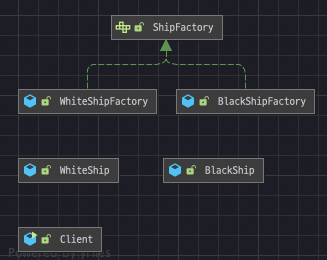

#Factory Method Patterns

- 객체 생성과 관련된 패턴 중 하나.
- 구체적인 어떤 인스턴스를 만들지는 서브 클래스가 정한다.
- 기존의 코드 변경 없이 확장하기 위한 디자인 패턴
- OCP 원칙을 지킬 수 있다.

---
- 장점과 단점
  - 장점:
    - 제품과 제품을 생성하는 팩토리 구조가 느슨한 결합으로 인하여 OCP 원칙을 지킬 수 있다.
    - Product 와 Creator 간의 커플링(결합)이 느슨함
  - 단점:
    - 역할을 나누다 보니 관리할 클래스의 갯수가 많아진다.
    - creator 클래스를 반드시 상속하여 Product 를 생성해야 한다.
  - OCP
    - 변경이 닫혀있다 - 기존 코드를 변경하지않는다.
    - 확장에 열려있다 - 새로운 기능을 확장할 수 있는 구조를 가진다.(새로운 인스턴스 추가)
  - 자바 8 interface > default method
    - 기존에는 interface 에 추상메서드만 정의가 가능했지만, 자바 8 부터는 기본 기능을 구현할 수 있게 되었다.
  - 자바 9 private 메서드
    - 자바 9 에서는 private method, private static method 가 추가됨
    - 자바 8 이 제공하는 default, static 은 내부에서 사용하고자 하여도 외부에 노출이 되는 꺼림칙한?부분이 있었지만
    - 자바 9 private 가 지원됨으로써 코드중복 및 캡슐화를 유지 할 수 있다.